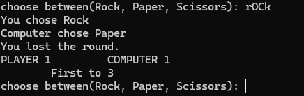
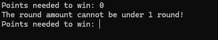
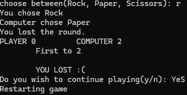

# Rock Paper Scissors

A simple command-line Rock Paper Scissors game built with Python.

The player competes against a randomly choosing computer opponent in customizable matches where they can choose how many points are required to win.

## Download

**[⬇️ Install Latest Version](https://github.com/sooskes/rock-paper-scissors.py/releases/latest)**

Download the latest `.exe` from the **Assets** section of the latest release.

## Features

* 🎮 Player vs Computer gameplay
* 🏆 Customizable points needed to win
* 🔢 Match lengths from 1 to 100 points
* ✂️ Rock, Paper, Scissors gameplay
* ⌨️ Short commands: `r`, `p`, `s`
* 🤖 Random computer move selection
* 📊 Player and computer score tracking
* 🏅 Automatic match winner detection
* 🔄 Replayability after completing a match
* 🛡️ Input validation
* 🧹 Terminal clearing for cleaner gameplay
* 🧩 Function-based program structure

## Screenshots

### Gameplay

### Input Validation

### Replayability

## How to Play

1. Download the latest `.exe` from the [latest release](https://github.com/sooskes/rock-paper-scissors.py/releases/latest).
2. Launch the game.
3. Choose how many points are needed to win.
4. Enter `Rock`, `Paper`, or `Scissors`.
5. You can also use `r`, `p`, or `s`.
6. Continue playing until either you or the computer reaches the required score.
7. Choose whether to restart or close the game.

## Changelog

### v1.1.0 — Custom Matches & Improved Gameplay

* Added a customizable points-needed-to-win system.
* Added a 1–100 limit for the required winning score.
* Added automatic match winner detection.
* Added a `"First to X"` score display.
* Added terminal clearing for cleaner gameplay.
* Improved input validation for the points-needed-to-win selection.
* Changed the replay system so players restart after completing a match instead of after every round.
* Improved the overall game flow by separating individual rounds from complete matches.

## Built With

* **Python**
* `random`
* `time`
* `os`

## License

This project is licensed under the MIT License.
