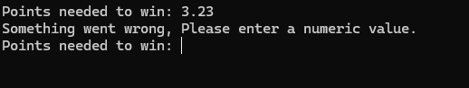

# Rock Paper Scissors

A console-based Rock Paper Scissors game written in Python featuring customizable matches, robust input validation, score tracking, replayability, and a randomly choosing computer opponent.

## 📥 Download

[](https://github.com/sooskes/rock-paper-scissors.py/releases/latest)

Download the latest Windows executable from the latest GitHub Release, or run the Python source code yourself.

---

## Table of Contents

* [Features](#features)
* [Gameplay Preview](#gameplay-preview)
* [Project Structure](#project-structure)
* [Running the Project](#running-the-project)
* [What I Learned](#what-i-learned)
* [Future Improvements](#future-improvements)
* [License](#license)

---

## Features

* 🎮 Classic Rock, Paper, Scissors gameplay
* 🏆 Customizable points needed to win
* 🔢 Match lengths from 1 to 100 points
* 🤖 Random computer move selection
* ⌨️ Short commands: `r`, `p`, `s`
* ✅ Robust input validation
* 🔤 Case-insensitive input
* 📊 Player and computer score tracking
* 🥇 Automatic match winner detection
* 🔁 Replay support after completing a match
* 🧹 Terminal clearing for a cleaner experience
* 🧩 Function-based program structure

---

## Gameplay Preview

### 🎮 Gameplay

Each round displays the player's and computer's choices, announces the winner of the round, and updates the scoreboard until one side reaches the required number of points.


---

### ⚠️ Round Input Validation

The game rejects invalid Rock, Paper, or Scissors choices and asks the player to enter a valid value. Both full names and the `r`, `p`, and `s` shortcuts are supported.



---

### 🔢 Points Input Validation

Before a match begins, the player chooses how many points are required to win. The game validates the input and only accepts values between 1 and 100.


---

### 🔁 Replayability

After a match ends, the player can choose whether to restart and play another match or close the game.


---

## Project Structure

```text
rock-paper-scissors.py/
│
├── scr/
│   └── main.py
│
├── screenshots/
│   ├── gameplay.png
│   ├── input-validation-1.png
│   ├── input-validation-2.png
│   └── replayability.png
│
├── README.md
├── LICENSE
└── .gitignore
```

---

## Running the Project

### Windows Executable

Download the latest Windows executable from the [Latest Release](https://github.com/sooskes/rock-paper-scissors.py/releases/latest).

Run the `.exe` to start the game.

### Python Source

Make sure Python is installed, then run:

```bash
python scr/main.py
```

---

## What I Learned

This project helped me practice:

* 🐍 Python programming
* 🔄 `while` loops and nested game loops
* 🧩 Functions and modular program structure
* 🎲 Random number generation
* 🛡️ Input validation
* 🔢 Score and match-state management
* 🧹 Managing and clearing terminal output
* 📦 Creating a standalone Windows executable with PyInstaller

---

## Future Improvements

* 🎨 Colored console output
* 📊 Detailed match statistics
* 🏅 Win/loss tracking across matches
* ⚙️ Additional game settings
* 🧠 Improved computer decision-making
* 🖥️ Graphical user interface

---

## 🙌 Original Project

This project was originally created by **[@baramanfadayan-byte](https://github.com/baramanfadayan-byte)**.

You can find the original project here:

**[🔗 rock-paper-scissors.py — Original Repository](https://github.com/baramanfadayan-byte/rock-paper-scissors.py)**

Thank you to **[@baramanfadayan-byte](https://github.com/baramanfadayan-byte)** for creating the original project that this repository was built from.


## License

This project is licensed under the MIT License.
